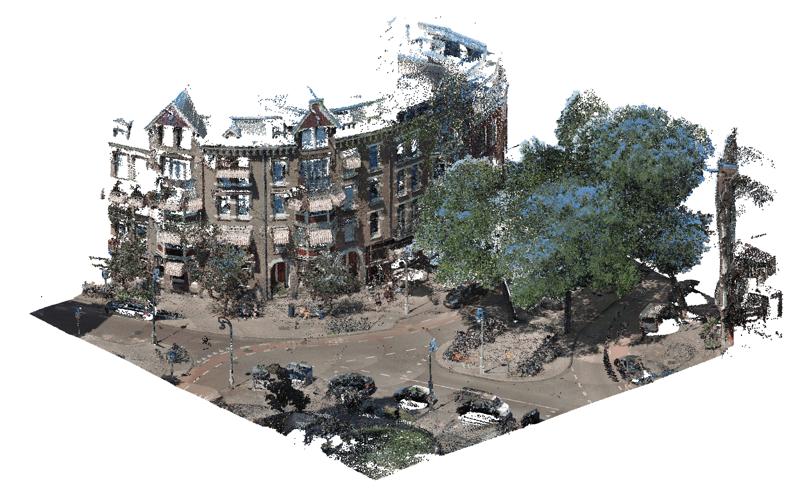

# Measuring sidewalk widths for Amsterdam

<figure align="center">
  
  <figcaption><b>Example:</b> static obstacles on the sidewalk.</figcaption>
</figure>

## Calculate sidewalk width using skeletons and centerlines
|  | | |
|:---:|:---:|:---:|

