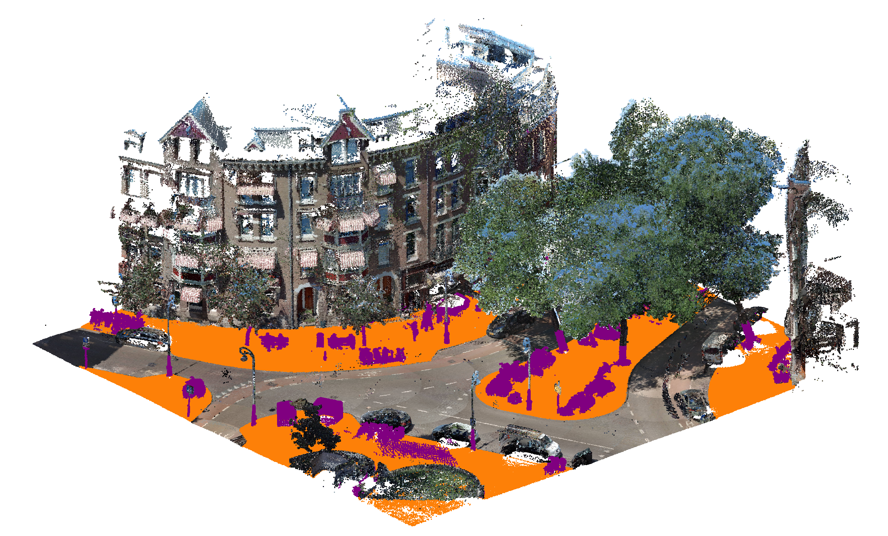
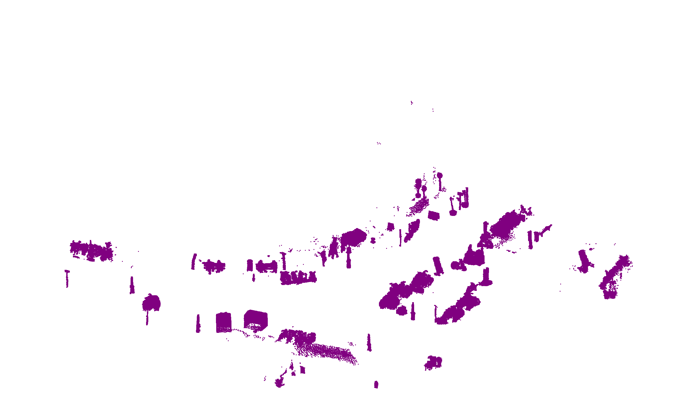
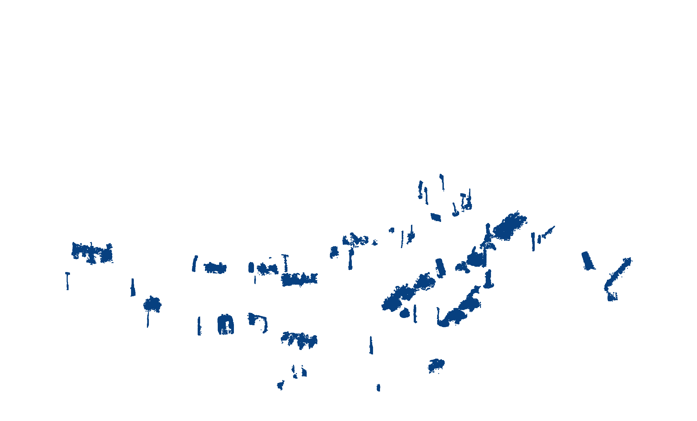
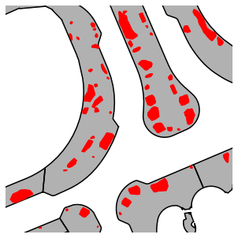
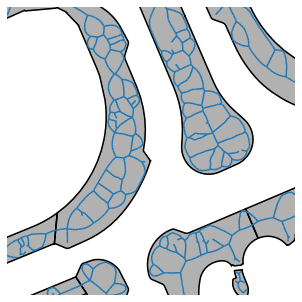
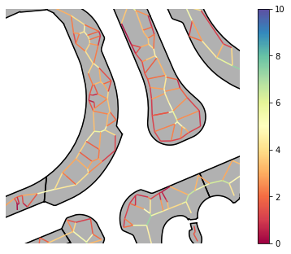

# Measuring sidewalk widths for Amsterdam

This repository contains a sidewalk width calculation approach by considering static obstacles on the sidewalk. This project is part of a broader [accessibility project](https://amsterdamintelligence.com/projects/amsterdam-for-all) to determine if [sidewalks are accessible](https://amsterdamintelligence.com/posts/accessiblesidewalkwidth) and make them more inclusive to people with disabilities. Two point cloud datasets are used in this project that were taken of the same area but at different times. First, cadastral reference data is used to filter for the points above the sidewalk. Next, a change detection algorithm, M3C2, is used to identify static objects in the point clouds. Finally, sidewalk width is calculated, inspired by Meli Harvey's [Sidewalk Widths NYC](https://github.com/meliharvey/sidewalkwidths-nyc) project. Please visit their repository to learn more about the calculation.

|  | | |
|:---:|:---:|:---:|

<b>Example:</b> (left) The point cloud with the sidewalk and points above it labeled. (middle) Points above the sidewalk. (right) M3C2 algorithm performed on two pointclouds. <br/>

|  | | |
|:---:|:---:|:---:|

<b>Example:</b> (left) M3C2 results overlayed on sidewalk polygons from topographical map. (middle) Centerline segments. (right) Width calculated along centerline segments. <br/>


---

## Folder Structure

 * [`datasets`](./datasets) _Demo dataset to get started_
   * [`ahn`](./datasets/ahn) _AHN elevation data_
   * [`bgt`](./datasets/bgt) BGT data_
   * [`pointcloud`](./datasets/pointcloud) _Example labeled urban point clouds_
 * [`media/examples`](./media/examples) _Visuals_
 * [`notebooks`](./notebooks) _Jupyter notebook tutorials_
 * [`src/upc_sw`](./src/upc_sw) _Python source code_

---

## Installation

1. Clone this repository:
    ```bash
    git clone https://github.com/Amsterdam-AI-Team/Urban_PointCloud_Sidewalk_Width.git
    ```

2. Install the dependencies:
    ```bash
    pip install -r requirements.txt
    ```

3. Additionally, install our [Urban PointCloud Processing](https://github.com/Amsterdam-AI-Team/Urban_PointCloud_Processing) package:
    ```bash
    pip install https://github.com/Amsterdam-AI-Team/Urban_PointCloud_Processing/releases/download/v0.1/upcp-0.1-py3-none-any.whl
    ```

4. Finally, install `cccorelib` and `pycc` by following the [instructions on their GitHub page](https://github.com/tmontaigu/CloudCompare-PythonPlugin/blob/master/docs/building.rst#building-as-independent-wheels). Please note, these two packages are not available on the Python Package Index (PyPi).

5. Check out the [notebooks](notebooks) for a demonstration.

---

## Usage

We provide tutorial [notebooks](notebooks) that demonstrate how the code can be used. Labeled example point clouds are provided to get started.

---

This repository was created by [Amsterdam Intelligence](https://amsterdamintelligence.com/) for the City of Amsterdam. See [our blog post](https://amsterdamintelligence.com/posts/computing-accessible-sidewalk-width-using-point-clouds-and-topographical-maps) on this topic for more details.
