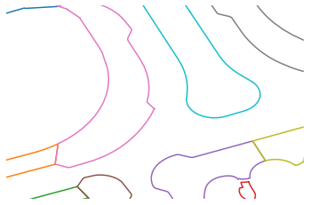
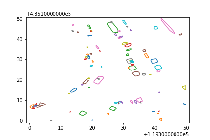

# Measuring sidewalk widths for Amsterdam

## Get obstacles from point cloud data
|  | | |
|:---:|:---:|:---:|

## Calculate sidewalk width using skeletons and centerlines
|  | | |
|:---:|:---:|:---:|

